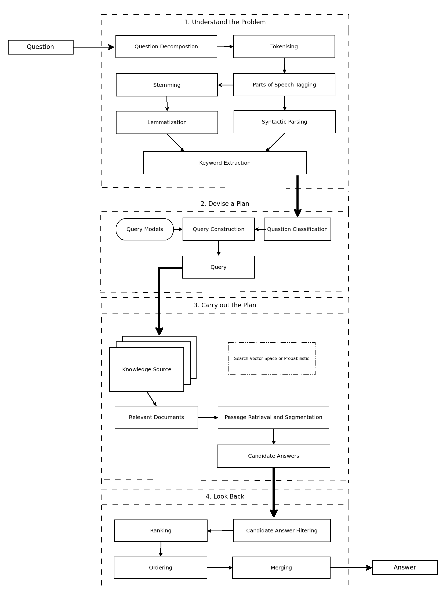
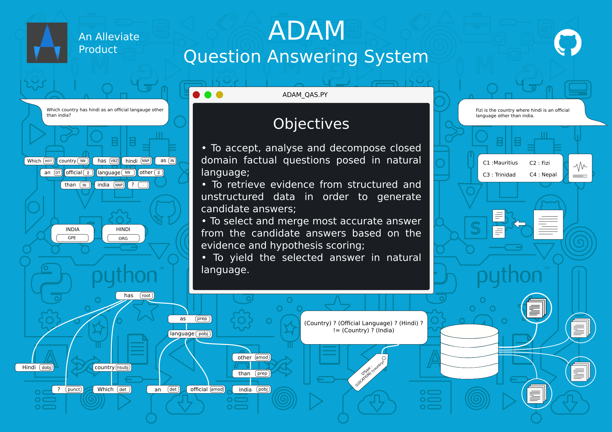

# ADAM - A Question Answering System
## *Alleviate*
Inspired by *IBM Watson* and *START*

### Requirements :
###### Python3 - [Python v3.5](https://docs.python.org/3/)
* [spaCy v1.8.2](https://spacy.io/)
* [scikit-learn v0.18](http://scikit-learn.org/)
* [gensim v2.1](https://radimrehurek.com/gensim/)
* [pandas v0.20](http://pandas.pydata.org/)
* [wikipedia v1.10](https://pypi.python.org/pypi/wikipedia/)

    * spaCy model - en_core_web_md v1.2

## System Architecture :

> (c) 2016-17, Shirish Kadam;
> (c) 2016-17, Amit Gunjal

## Work FLow

> (c) 2016-17, Shirish Kadam;
> (c) 2016-17, Amit Gunjal
## Reference Material
1. [ADAM Reference](https://drive.google.com/open?id=0B7Paai6yoeuHNHpOT01IaGZzYlE)
2. [Research Papers](https://drive.google.com/open?id=0B7Paai6yoeuHcmYtaS1tNWJ6U1k)
> Restricted Access

##### Development Environment :
* OS - Linux Mint 18.1 (64 bit)
* IDE - Intellij IDEA 2017 / PyCharm 2017

## Branches :
1. master - Production Branch
2. experimental - Experimental Branch

###### Coding Standards : 
Follow these coding style for [Python](http://docs.python-guide.org/en/latest/writing/style/)
Appropriate comments necessary at that relevant code

## Copyright License :

Attribution-NonCommercial-NoDerivs 

CC BY-NC-ND

Visit [Creative Commons](https://creativecommons.org/licenses/by-nc-nd/4.0/)

